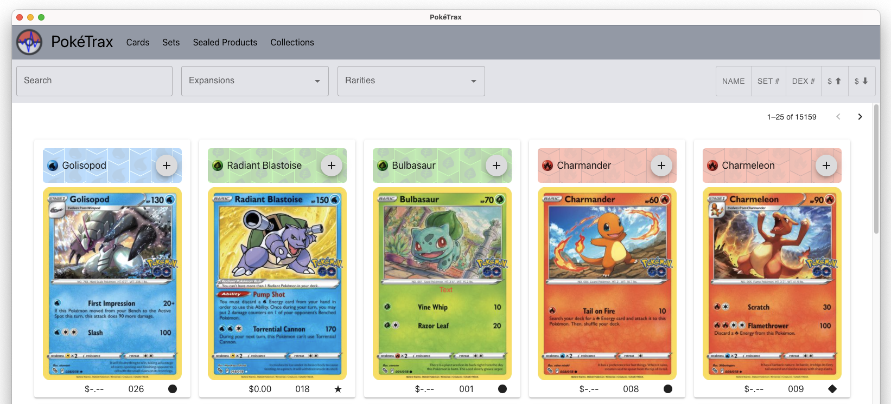

#  PokeTrax

Pokemon Card Data tracking card collection



## Recommended IDE Setup

- [VS Code](https://code.visualstudio.com/) + [Tauri](https://marketplace.visualstudio.com/items?itemName=tauri-apps.tauri-vscode) + [rust-analyzer](https://marketplace.visualstudio.com/items?itemName=rust-lang.rust-analyzer)

## Development

The Applicaiton has two part a rust tauri backend and a Single page svelte applicaiton 

### Backend tauri server

Will lauch a window with what ever ui is in the src folder.

Normal

```sh
cargo tauri dev
```

Stack Trace

```sh
RUST_BACKTRACE=1 cargo tauri dev 
```

### Frontend Svelete app

Will lauch a browser to load web app.  Server needs to be running on you will get nothing but a loading screen. If you lauch the server after lauching web app refresh the page to get past loading screen

```sh
npm run dev
```

## Build installer

This will build an executeable for your Operating system.

Build Process
Note: TAURI_PRIVATE_KEY needs to set set or you will get an error. You can create your own key or remove the updater options in tauri.conf.json

```sh
cd src-web 
npm run build
cd ..
cargo tauri build
```

## Build Rust Documentation

```sh
cd src-tauri
cargo doc --no-deps
```

## Usage

### ENV Variables

PK_DATA_DIR="./data" Data directory for data files

### Parameters
| Name | Function |
| --- | --- |
| -h | headless |
| -a | Admin mode |

# Maintainer instuctions

### Create symlink to executable

Symlink to executable for headless

```sh
ln -s /Applications/PokeTrax.app/Contents/MacOS/PokeTrax poketrax
```

```sh
poketrax -h
```

### Process for Updating Version

   1. Create Release in Github
   1. Make sure src-tauri/tauri.conf.json version matches Release.
   1. Action will produce artifacts
   1. Run 
      ```sh
       cd src-pages
       npm run build-prod
      ```
    1. Commit document changes to update update.json.